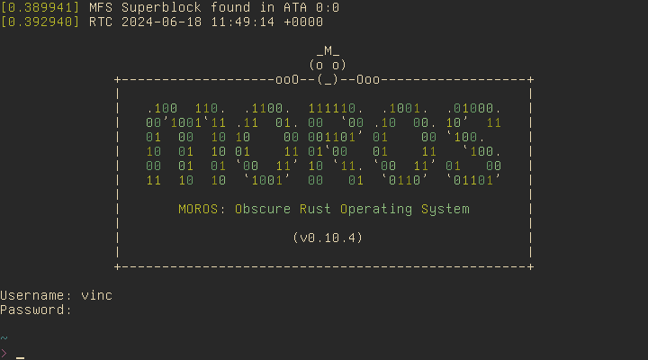

# MOROS: Obscure Rust Operating System

MOROS is a hobby operating system written in Rust by [Vincent Ollivier][0].

It targets computers with a x86-64 architecture and a BIOS, so mostly from 2005
to 2020, but it also runs well on most emulators (Bochs, QEMU, and VirtualBox).

This project started from the [seventh post][1] of the second edition of
[Writing an OS in Rust][2] by Philipp Oppermann and by reading the
[OSDev wiki][3] along with many open source kernels.

[![GitHub Actions][s1]](https://github.com/vinc/moros)
[![Crates.io][s2]](https://crates.io/crates/moros)

## Features

- External bootloader (using [bootloader][4])
- x86 CPU support (using [x86_64][5])
- Hardware interrupts (using [pic8259][6])
- PS/2 Keyboard with customizable layout (using [pc-keyboard][7])
- VGA Text mode with customizable font and color palette
- Serial output (using [uart_16550][8])
- Paging
- Heap allocation (using [linked_list_allocator][9])
- ACPI shutdown (using [acpi][10]) and [aml][11])
- RTC clock
- PCI devices
- ATA PIO mode
- Random number generator (using [rand_hc][12])
- RTL8139 network card
- AMD PCNET network card
- DHCP/IP/TCP/UDP/DNS/HTTP network protocols (using [smoltcp][13])
- Basic [filesystem](doc/filesystem.md)
- Basic [shell](doc/shell.md)
- Basic [text editor](doc/editor.md)
- Basic [lisp](doc/lisp.md) interpreter
- Basic userspace for NASM and Rust programs
- Some file and [network](doc/network.md) commands
- Some [games](doc/games.md)

## Documentation

Documentation is available [here](doc/index.md)

## Setup

You will need `git`, `gcc`, `make`, `curl`, `qemu-img`,
and `qemu-system-x86_64` on the host system.

Clone the repo:

    $ git clone https://github.com/vinc/moros
    $ cd moros

Install the required tools with `make setup` or the following commands:

    $ curl https://sh.rustup.rs -sSf | sh -s -- -y --default-toolchain none
    $ rustup show
    $ cargo install bootimage

## Usage

Build the image to `disk.img`:

    $ make image output=video keyboard=qwerty

Run MOROS in QEMU:

    $ make qemu output=video nic=rtl8139

Run natively on a x86 computer by copying the bootloader and the kernel to a
hard drive or USB stick (but there is currently no USB driver so the filesystem
will not be available in that case):

    $ sudo dd if=target/x86_64-moros/release/bootimage-moros.bin of=/dev/sdx

MOROS will open a console in diskless mode after boot if no filesystem is
detected. The following command will setup the filesystem on a hard drive,
allowing you to exit the diskless mode and log in as a normal user:

    > install

**Be careful not to overwrite the hard drive of your OS when using `dd` inside
your OS, and `install` or `disk format` inside MOROS if you don't use an
emulator.**

## Tests

Run the test suite in QEMU:

    $ make test

## License

MOROS is released under MIT.

[0]: https://vinc.cc
[1]: https://github.com/phil-opp/blog_os/tree/post-07
[2]: https://os.phil-opp.com
[3]: https://wiki.osdev.org
[4]: https://github.com/rust-osdev/bootloader
[5]: https://crates.io/crates/x86_64
[6]: https://crates.io/crates/pic8259
[7]: https://crates.io/crates/pc-keyboard
[8]: https://crates.io/crates/uart_16550
[9]: https://crates.io/crates/linked_list_allocator
[10]: https://crates.io/crates/acpi
[11]: https://crates.io/crates/aml
[12]: https://crates.io/crates/rand_hc
[13]: https://crates.io/crates/smoltcp

[s1]: https://img.shields.io/github/actions/workflow/status/vinc/moros/rust.yml
[s2]: https://img.shields.io/crates/v/moros.svg
