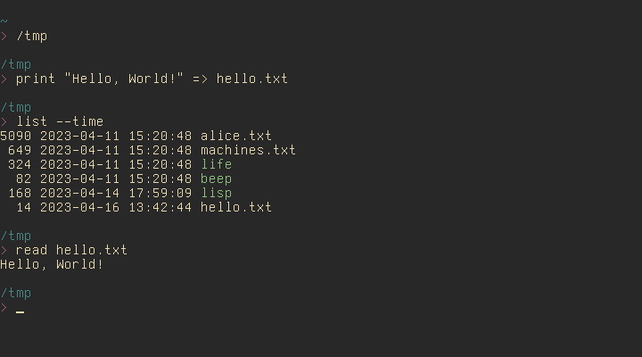
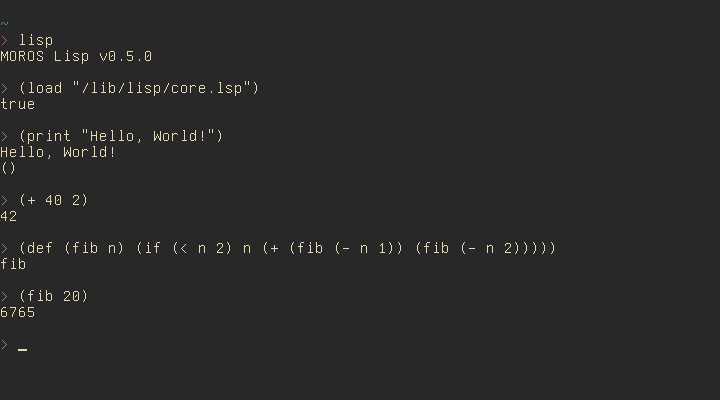
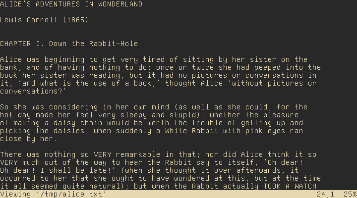
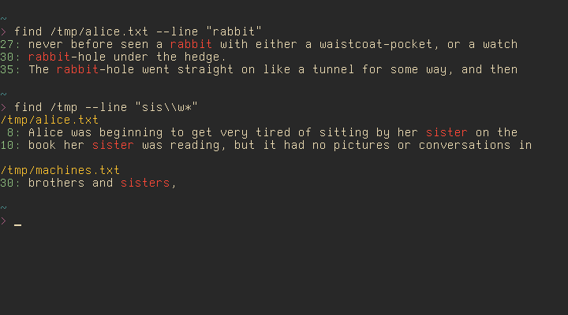
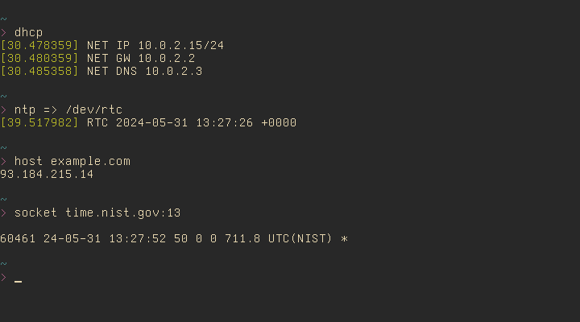
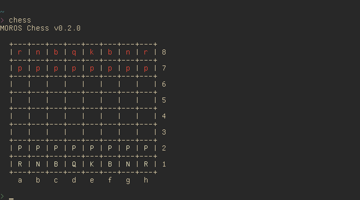
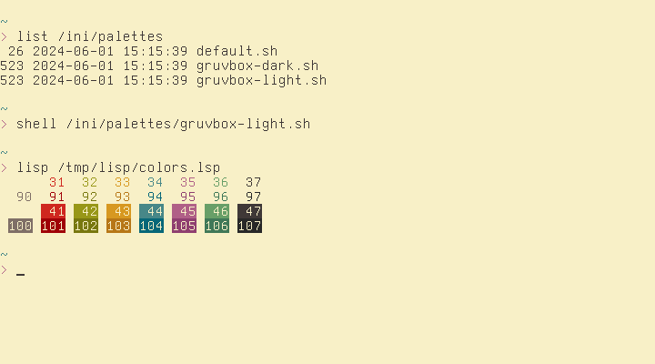

# MOROS: Obscure Rust Operating System

MOROS is a hobby operating system written in Rust by
[Vincent Ollivier](https://vinc.cc).

It targets [computers](hardware.md#computers) with an x86-64 architecture and a
BIOS, typically from 2005 to 2020. It also runs well on most
[emulators](hardware.md#emulators).

## Usage

MOROS is open source. You can [build](https://github.com/vinc/moros) or
[download](https://github.com/vinc/moros/releases) an image. Check out
the [manual](manual.md) for details on how to use it.

## Features

MOROS is text-based and draws inspiration from Unix and DOS to provide a simple
and efficient environment for computing and communication from the command
line. Each program is designed to ensure a cohesive user interface across the
entire system.

The [shell](shell.md) is the hearth of MOROS, used to navigate the
[filesystem](filesystem.md) and run other programs:

A [lisp](lisp.md) interpreter serves as the primary programming environment to
extend the userspace:

A basic [text editor](editor.md) is included for editing text files and
scripts, and a derived text viewer offers a distraction-free experience for
reading long texts:

Other utilities include a [calculator](calculator.md) and the `find` command,
which uses a simple [regex engine](regex.md) to search files or lines in the
filesystem:

MOROS features a [network stack](network.md) with drivers for Intel PRO/1000,
RTL8139, and PCNET cards, enabling internet access:

It also includes some [games](games.md):

And it's quite [customizable](colors.md):

## Demo

Log in to a demo using the name of the system as the password for the guest
account:

    $ ssh guest@try.moros.cc

Happy hacking!
