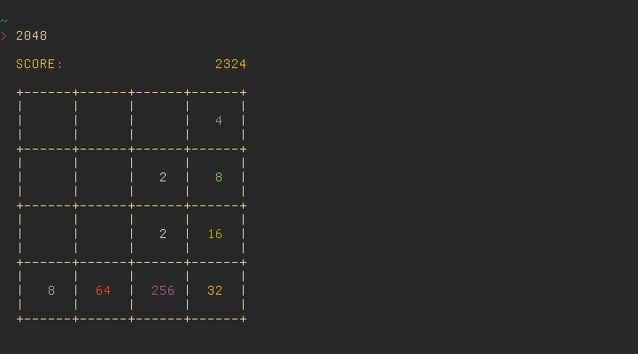
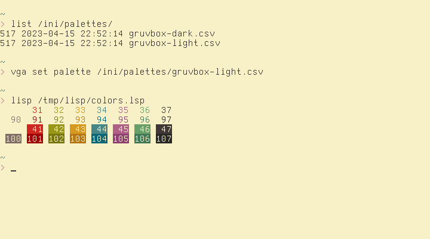

# MOROS: Obscure Rust Operating System

MOROS is a hobby operating system written in Rust by [Vincent Ollivier](https://vinc.cc).

It targets computers with a x86-64 architecture and a BIOS, so mostly from 2005
to 2020, but it also runs well on most emulators (Bochs, QEMU, and VirtualBox).

## Usage

MOROS is open source, you can [build it](https://github.com/vinc/moros)
or [download an image](https://github.com/vinc/moros/releases). Consult the
[manual](manual.md) to learn how to use the system.

## Features

Everything in MOROS is done from a command line interface and most programs are
rather minimalist.

It has a [shell](shell.md):

With a few programs like `find` that use a [regex engine](regex.md) to find
files or lines:

It has a [calculator](calculator.md) and also a [lisp](lisp.md) interpreter:

And a [text editor](editor.md):

It has a [network stack](network.md) with two drivers for RTL81339 and PCNET cards:

It has a chess game:

And the game of life:

It even has 2048:

And finally it is quite customizable:

## Demo

You can log in to a demo with the following command using the name of the
system as a password for the guest account:

    $ ssh guest@try.moros.cc

